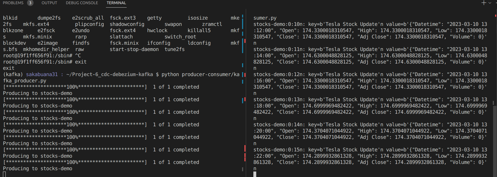

# kafka-stream-stock-market

  

  
  

<h1 align="center">
  hey there
  
</h1>

### :dart: Goals :
> Using docker to running kafka stream stock market producer and consumer

### :newspaper: Documentation :
1. run `docker-compose up -d` kafka and zookeeper image container
2. create env and install requirements
3. use the first terminal and run `python3 producer-consumer/kafka_producer.py` python producer script to produces the message to the Kafka topic every 1 minutes
4. open second terminal and run `python3 producer-consumer/kafka_consumer.py` consumer producer script is subscribed to the topic and using a for loop we print details of the message
5. this image below is the output of both of producer and consumer terminal show kafka streaming data

    
